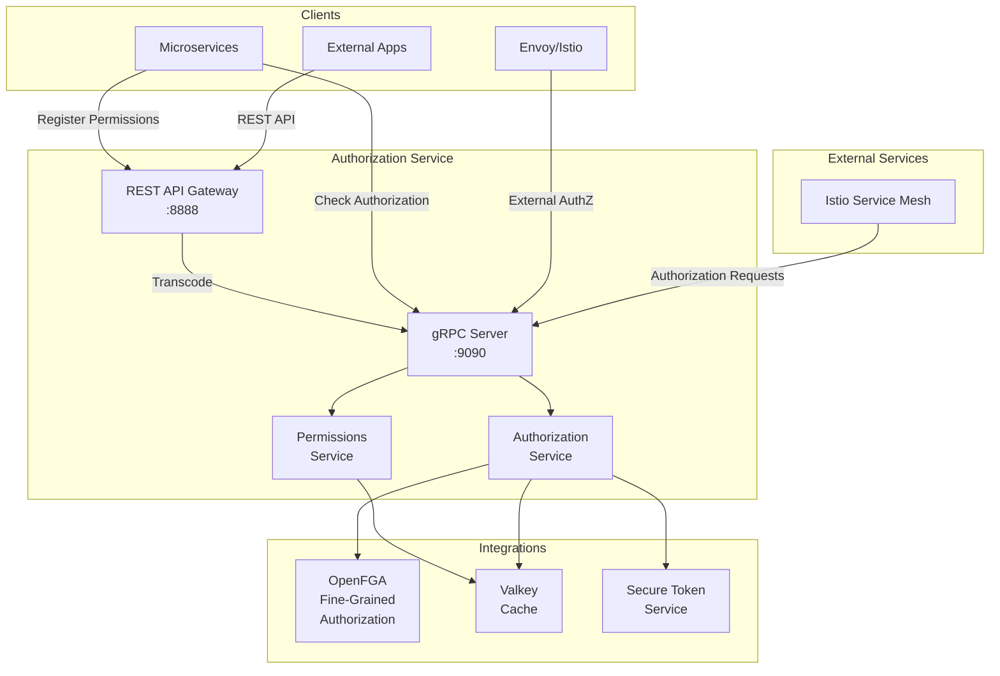

<p align="center">
  
</p>

# Authorization Service
A production-grade gRPC and REST API service for managing authorization and permissions in a microservices architecture. Built with Go 1.25, leveraging OpenFGA for fine-grained authorization and Valkey for caching.
## Overview
The Authorization Service (codename Cerberus) is designed to provide:
1. **Permission Management**: Register and manage service permissions via a versioned gRPC API
2. **Authorization Checks**: Perform authorization decisions using OpenFGA
3. **Envoy Integration**: Implements Envoy's External Authorization API for use with Istio
4. **Caching**: Uses Valkey for high-performance authorization decision caching
6. **Token Validation**: Integrates with the Secure Token Service (STS) for token validation
## Architecture

## Project Structure
```
authorization-service/
├── main.go                             # Application entry point
├── cmd/
│   ├── root.go                         # Root command definition (Cobra)
│   ├── serve.go                        # Serve command + configuration
│   └── version.go                      # Version command
├── api/proto/v1/
│   ├── permissions.proto               # Permissions service definition
│   └── authorization.proto             # Authorization service definition
├── internal/
│   ├── integrations/
│   │   ├── openfga/                    # OpenFGA client wrapper
│   │   ├── valkey/                     # Valkey (Redis) client
│   │   └── sts/                        # STS gRPC client
│   ├── server/
│   │   ├── grpc/                       # gRPC server implementation
│   │   └── rest/                       # REST gateway implementation
│   ├── service/
│   │   ├── permissions/                # Permissions business logic
│   │   └── authz/                      # Authorization business logic
│   └── testutil/                       # Testing utilities
├── tests/
│   ├── integration/                    # Integration tests
│   └── unit/                           # Unit tests
├── docker/
│   ├── app/                            # Application Docker files
│   │   ├── Dockerfile
│   │   └── docker-compose.yml
│   └── dependencies/                   # Dependencies Docker Compose
│       └── docker-compose.yml
├── k8s/                                # Kubernetes manifests
├── scripts/                            # Build and utility scripts
├── Makefile                            # Build automation
├── go.mod & go.sum                     # Module definition and checksums
└── .env.example                        # Environment variables template
```
## Features
- **Cobra CLI**: Professional command-line interface with automatic help generation
- **Versioned gRPC APIs** with Go code generation from protobuf definitions
- **REST API Gateway** using grpc-gateway for transcoding gRPC to REST
- **OpenFGA Integration** with pluggable no-op implementation for development
- **Valkey Caching** for high-performance authorization decision caching
- **envconfig** for environment-based configuration management
- **Secure Token Service Integration** for token validation
- **Kafka Integration** for async ingestion pipeline
- **Comprehensive Logging** with structured JSON logging
- **Health Checks** for gRPC and HTTP endpoints
- **Graceful Shutdown** with connection cleanup and signal handling
## Prerequisites
- **Go**: 1.25 or later
- **Docker**: For running dependencies
- **Docker Compose**: For orchestrating containers
## Installation & Setup
### 1. Clone the Repository
```bash
git clone https://github.com/canonical/authorization-service.git
cd authorization-service
```
### 2. Install Dependencies
```bash
go mod download
go mod tidy
```
### 3. Build the Service
```bash
make build
```
This creates `bin/authz-service` binary.
## Running the Service
### Quick Start (Recommended)
```bash
# Start dependencies
make start-deps
# Run the service (in another terminal)
./bin/authz-service serve
```
### Development Mode
Builds, starts dependencies, and runs with debug logging:
```bash
make dev
```
### Using Make
```bash
make build          # Build binary
make run            # Run service
make start-deps     # Start dependencies
make stop-deps      # Stop dependencies
make test           # Run tests
make coverage       # Generate coverage report
```
## CLI Commands
The service uses [Cobra](https://github.com/spf13/cobra) for its CLI:
### `serve` - Start the Service
```bash
./bin/authz-service serve
```
Starts both gRPC (:9090) and REST (:8888) servers. Configuration via environment variables.
### `version` - Show Version
```bash
./bin/authz-service version
# Output: Authorization Service (Codename: Cerberus) v1.0.0
```
### `--help` - Show Help
```bash
./bin/authz-service --help
./bin/authz-service serve --help
```
## Configuration
Configuration is managed through environment variables using [envconfig](https://github.com/kelseyhightower/envconfig) library.
### Server Configuration
| Variable | Type | Default | Description |
|----------|------|---------|-------------|
| `GRPC_PORT` | int | 9090 | gRPC server port |
| `HTTP_PORT` | int | 8888 | REST gateway port |
| `SERVER_HOST` | string | 0.0.0.0 | Server bind address |
| `SERVER_SHUTDOWN_TIMEOUT` | duration | 30s | Graceful shutdown timeout |
### OpenFGA Configuration
| Variable | Type | Default | Description |
|----------|------|---------|-------------|
| `OPENFGA_ENABLED` | bool | true | Enable OpenFGA (false = use no-op client) |
| `OPENFGA_ADDRESS` | string | localhost:8081 | OpenFGA server address |
| `OPENFGA_STORE_ID` | string | (empty) | OpenFGA store ID |
| `OPENFGA_AUTH_KEY` | string | (empty) | OpenFGA authentication key |
| `OPENFGA_USE_TLS` | bool | false | Use TLS for OpenFGA |
| `OPENFGA_TIMEOUT` | duration | 10s | Request timeout |
### Valkey Configuration
| Variable | Type | Default | Description |
|----------|------|---------|-------------|
| `VALKEY_ADDRESS` | string | localhost:6379 | Valkey server address |
| `VALKEY_PASSWORD` | string | (empty) | Valkey password |
| `VALKEY_DB` | int | 0 | Database number |
| `VALKEY_POOL_SIZE` | int | 10 | Connection pool size |
| `VALKEY_TIMEOUT` | duration | 5s | Connection timeout |
| `VALKEY_USE_TLS` | bool | false | Use TLS |
### STS Configuration
| Variable | Type | Default | Description |
|----------|------|---------|-------------|
| `STS_ADDRESS` | string | localhost:9091 | STS server address |
| `STS_USE_TLS` | bool | false | Use TLS |
| `STS_TIMEOUT` | duration | 10s | Request timeout |
### Logging Configuration
| Variable | Type | Default | Description |
|----------|------|---------|-------------|
| `LOG_LEVEL` | string | info | Log level: debug, info, warn, error |
| `LOG_FORMAT` | string | json | Format: json or text |
### Example Configuration
```bash
export GRPC_PORT=9090
export HTTP_PORT=8888
export LOG_LEVEL=debug
export OPENFGA_ADDRESS=localhost:8081
export VALKEY_ADDRESS=localhost:6379
./bin/authz-service serve
```
Or create `.env` file:
```bash
GRPC_PORT=9090
HTTP_PORT=8888
LOG_LEVEL=debug
OPENFGA_ENABLED=true
```
Then load it:
```bash
export $(cat .env | xargs)
./bin/authz-service serve
```
## Running Tests
### Unit Tests
```bash
go test -v ./... -short
```
### Integration Tests
Requires Docker:
```bash
go test -v ./tests/integration/...
```
### Coverage Report
```bash
go test -coverprofile=coverage.out ./...
go tool cover -html=coverage.out
```
## Docker
### Build Image
```bash
make docker
```
### Run with Docker Compose
```bash
cd docker/dependencies
docker-compose up -d
cd docker/app
docker-compose up
```
## Kubernetes Deployment
### Deploy to Kubernetes
```bash
kubectl apply -f k8s/deployment.yaml
```
### Testing with Istio (via Kind)
```bash
# Setup Kind cluster with Istio
./scripts/setup-kind.sh
# Build and load image
docker build -f docker/app/Dockerfile -t authorization-service:latest .
kind load docker-image authorization-service:latest --name authz-dev
# Deploy
kubectl apply -f k8s/deployment.yaml
kubectl apply -f k8s/istio-authz-policy.yaml
```
**Note**: Docker Compose cannot run a full Istio service mesh. Use Kind, Minikube, or k3s for Istio testing.
## API Endpoints
### gRPC APIs (Port 9090)
- `authz.v1.PermissionsService/RegisterPermissions`
- `authz.v1.PermissionsService/GetPermissions`
- `authz.v1.PermissionsService/ListPermissions`
- `authz.v1.PermissionsService/DeletePermissions`
- `authz.v1.Authorization/Check` (Envoy External Auth)
### REST API (Port 8888)
- `POST /v1/permissions` - Register permissions
- `GET /v1/permissions/{service_id}` - Get permissions
- `GET /v1/permissions` - List all permissions
- `DELETE /v1/permissions/{service_id}` - Delete permissions
- `GET /healthz` - Health check
## Testing Endpoints
### Test gRPC
```bash
grpcurl -plaintext localhost:9090 list
grpcurl -plaintext localhost:9090 grpc.health.v1.Health/Check
```
### Test REST
```bash
curl http://localhost:8888/healthz
```
## Troubleshooting
### Service Won't Start
```bash
# Check environment variables
env | grep GRPC_PORT
# Run with debug logging
LOG_LEVEL=debug ./bin/authz-service serve
# Check port availability
lsof -i :9090
lsof -i :8888
```
### Can't Connect to Dependencies
```bash
# OpenFGA
curl http://localhost:8080/healthz
# Valkey
redis-cli -h localhost ping
```
## Contributing
See [CONTRIBUTING.md](CONTRIBUTING.md) for guidelines.
## License
See [LICENSE](LICENSE) file for details.
