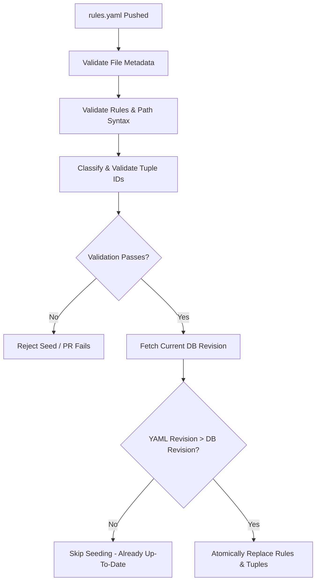

# Authorization-service Federation Guide & Rules Validation

This guide provides the complete set of instructions, restrictions, and validation requirements for teams wishing to federate their service with **Authorization-service**. 

When submitting a Pull Request for federation onboarding, your configuration must comply with the rules outlined below to ensure it can be parsed, compiled, and resolved deterministically.

---

## 1. Structure of a Federation Pull Request

According to the [.github/PULL_REQUEST_TEMPLATE/federation_onboarding.md](file:///home/barco/GolandProjects/authorization-service/.github/PULL_REQUEST_TEMPLATE/federation_onboarding.md) template, a federation onboarding PR must contain three critical file changes:

1. **`authz/model/fga.mod`**
   Must be updated to include your new service module so OpenFGA can compile the global authorization model.
2. **`authz/model/services/<service-slug>/<service-slug>.fga`**
   The OpenFGA module contribution containing your domain-specific types, relations, and authorization model logic.
3. **`authz/model/services/<service-slug>/rules.yaml`**
   The authoritative routing and permission mapping rules for your endpoints (reconciled dynamically by Authorization-service on database startup or via seed command).

---

## 2. Character Restrictions & Naming Conventions

To prevent parsing anomalies and security issues, Authorization-service enforces strict syntactic rules on route matches, placeholders, and tuples.

### Route Match Paths (`match`)
- **Prefix**: Every path pattern must start with a leading slash `/` (e.g., `/api/v1/invoices`).
- **Whitespace**: No spaces or tab characters are allowed anywhere in the match path.

### Path Placeholders (`{paramName}`)
- **Format**: Dynamic path placeholders must be enclosed in single curly braces (e.g., `{invoiceId}`).
- **Well-Formed & Balanced**: Curly braces must be properly opened and closed. 
  - Nested curly braces are strictly prohibited (e.g., `{nested{param}}` is invalid).
  - Unmatched braces (e.g., `{param` or `param}`) are invalid.
- **Allowed Characters**: Placeholder names can only contain alphanumeric characters and underscores:
  - `[a-zA-Z0-9_]`
- **Uniqueness**: A placeholder name must be unique within a single match pattern. For example:
  - `/api/v1/groups/{groupId}/members/{groupId}` is **invalid** (duplicate placeholder `groupId`).
  - `/api/v1/groups/{groupId}/members/{memberId}` is **valid**.

### Terminal Wildcards (`**`)
- The terminal wildcard pattern `**` represents "any remaining suffix path".
- **Terminal Constraint**: If a wildcard `**` is present in a match path, it must be the **final construct** of the pattern.
- **No Suffix Segments**: No segments, characters, or trailing slashes are allowed after `**`:
  - `/api/v1/admin/**` is **valid**.
  - `/api/v1/admin/**/reports` is **invalid**.
  - `/api/v1/**/items/{itemId}` is **invalid**.

### Service Scoping & Type Namespacing (`serviceSlug/type`)
To isolate authorization models and resource types to a specific service scope and prevent naming collisions across federated services, Authorization-service relies on the `serviceSlug/type` nomenclature supported by OpenFGA model syntax.

#### Service Slugs
- **Assignment**: Service slugs are proposed by teams during Pull Request onboarding. Any naming collisions or adjustments are addressed and resolved during the PR review process.
- **Namespace Boundary**: The `serviceSlug` acts as the primary namespace preventing collisions across federated services (e.g., `dummy`).

#### Scoped vs. Unscoped OpenFGA Types
- **Unscoped OpenFGA Types**: The core module of the model provides global, unscoped OpenFGA types (e.g., `user`, `group`) intended for shared use across the entire platform. Other services may propose their own unscoped types for global use.
- **Scoped OpenFGA Types**: Services define domain-specific OpenFGA types scoped with their `serviceSlug` (e.g., `dummy/testGroup`, `dummy/domainAdmin`) for their internal domain logic.
- **Multitenancy Scope**: When multitenancy is enabled, the nomenclature extends to include the tenant identifier as a prefix:
  - `tenantX/dummy/testGroup`

#### Event Topic ACLs & Ingestion Validation
- **Topic Write Isolation**: Each federated service will have an ACL granting write access strictly to a single event topic matching `permissions.<serviceSlug>`. Meanwhile, Authorization-service maintains read access to all available service topics following this slug-based nomenclature.
---

## 3. Tuple Validation & Classification

Every authorization rule contains a list of `tuples`. For each tuple, the `objectResourceId` is classified dynamically to determine if it is **static** or **dynamic**.

### Dynamic `objectResourceId` (Variables)
- **Definition**: An `objectResourceId` is classified as **dynamic** if and only if it is enclosed in curly braces `{...}` in the YAML file (e.g., `objectResourceId: "{invoiceId}"`).
- **Capture Group Mapping**: A dynamic `objectResourceId` is only valid if its enclosed name exactly matches a named placeholder defined in the route `match` path.
  - Match: `/api/v1/invoices/{invoiceId}` $\rightarrow$ Tuple ID: `{invoiceId}` (**valid**).
  - Match: `/api/v1/invoices/{invoiceId}` $\rightarrow$ Tuple ID: `{customerId}` (**invalid** - no such placeholder).
- **Wildcard Constraint**: If the match path contains a terminal wildcard `**` but does not contain any other placeholder elsewhere in the path (e.g., `/api/v1/admin/**`), you **cannot** use a dynamic `objectResourceId`. It must be static because there is no capture group available to resolve it at runtime.

### Static `objectResourceId` (Literals)
- **Definition**: Any `objectResourceId` that is **not** enclosed in curly braces is classified as **static** (e.g., `objectResourceId: "global"`, `objectResourceId: "id"`).
- **No Mapping Required**: Static resource IDs are treated as literal constants and do not need to match any capture group in the path.

---

## 4. Automatic Validation & Seeding Pipeline

When your PR is merged, or when running the seeding pipeline locally, the **Authorization-service Seeder** processes files using the following strict pipeline:



### Validation Phase
1. **Metadata Check**: Verifies that `version: "1"` is declared, and both `service` slug and `revision` are non-empty.
2. **Duplicate Rules**: Ensures there is no duplicate combination of `method` and `match` (e.g., two rules for `GET /api/v1/status`).
3. **Duplicate Tuples**: Validates that all tuples within a single rule are unique to prevent redundant DB rows.
4. **Path & Placeholders**: Parses each match path, runs syntactic checks on curly braces and wildcards, and ensures dynamic tuples have corresponding capture groups.
5. **Namespace Alignment**: Verifies that all scoped-permission tuples belong strictly to the service's own namespace (`serviceSlug`), rejecting cross-namespace declarations.

### Natural Revision Comparison & Atomic Seeding
If the file validation succeeds:
1. Authorization-service queries the database for the current revision registered for your `service` slug.
2. It compares the YAML's `revision` with the database's revision using **Natural Version Comparison** (supporting numerical components, alpha/beta tags, and release candidates safely, e.g., `2026.07.24.1 > 2026.07.24.0`, or `rc-2 > rc-1`).
3. **Seeding Action**:
   - If the new revision is **lexicographically/numerically greater** than the current one, Authorization-service opens a transaction, removes all previous rules for your service, compiles the new routes, and inserts them atomically.
   - If the revision is equal or lesser, Authorization-service gracefully skips your service without raising an error.

---

## 5. Recommended Local Verification

Before submitting your PR, it is highly recommended to validate your configuration files locally using the Authorization-service CLI tool:

### Build Authorization-service
```bash
make build
```

### Route Rules Validation (No environment or DB required)
To validate the syntax and structure of the `rules.yaml` files, you can use the `seed validate` command. Both `seed validate` and `seed --dry-run` are completely independent of environment configurations or active databases.

To validate files in a custom physical directory:
```bash
./bin/app seed validate --dir authz/model/services
```

To validate embedded rules:
```bash
./bin/app seed validate
```

Example output:
```json
{"time":"2026-07-29T11:03:08.628088638+02:00","level":"INFO","msg":"Starting route rules validation"}
{"time":"2026-07-29T11:03:08.628158476+02:00","level":"INFO","msg":"Scanning for embedded route rules"}
{"time":"2026-07-29T11:03:08.628304697+02:00","level":"INFO","msg":"Validating rules file","path":"services/dummy/rules.yaml","service":"dummy","revision":"2026.07.24.1"}
{"time":"2026-07-29T11:03:08.628343658+02:00","level":"INFO","msg":"Validation succeeded","path":"services/dummy/rules.yaml","service":"dummy","revision":"2026.07.24.1"}
{"time":"2026-07-29T11:03:08.628350313+02:00","level":"INFO","msg":"Validation completed successfully"}
```

> [!TIP]
> You can also use `./bin/app seed --dry-run` which behaves identically and is also fully independent of environment variables and configurations.

