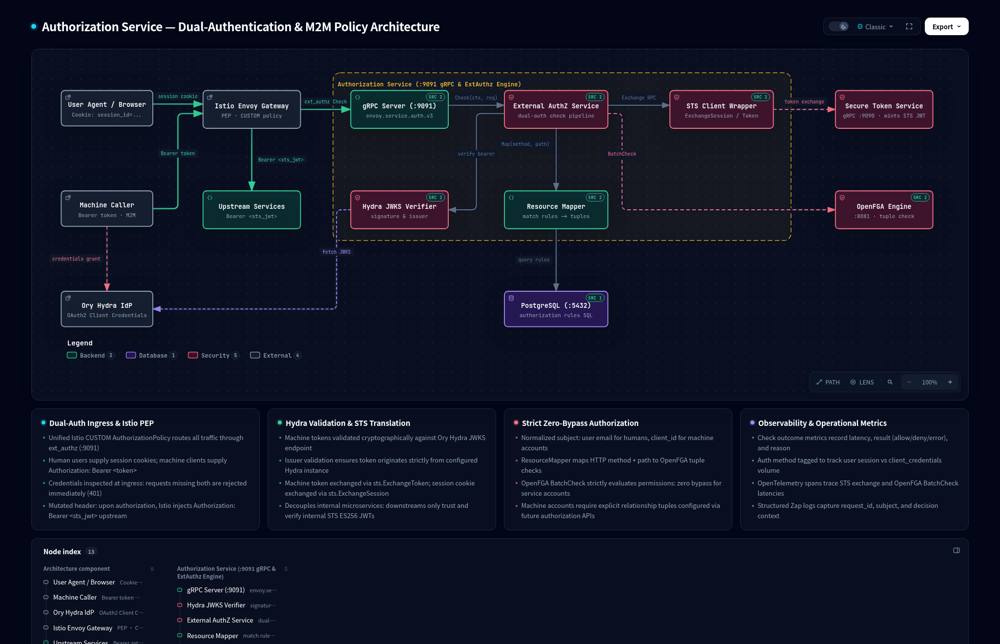

# Spec Delta

## Purpose

Provides Envoy external authorization (`ext_authz`) supporting dual authentication for human session cookies and machine client credentials tokens, exchanging them for internal STS JWTs and enforcing OpenFGA fine-grained authorization.

## ADDED Requirements

### Requirement: Dual Credential Extraction and Authentication Dispatch
The external authorization service SHALL inspect incoming Envoy `CheckRequest` headers and dispatch authentication strictly based on whether a single valid credential format is provided.

#### Scenario: User session cookie credential present
- **WHEN** an incoming request contains a `Cookie` header containing a `session_id` cookie and no `Authorization: Bearer` header
- **THEN** the service dispatches to the user session flow and exchanges the session cookie with STS

#### Scenario: Machine Bearer token credential present
- **WHEN** an incoming request contains an `Authorization: Bearer <token>` header and no `session_id` cookie
- **THEN** the service dispatches to the machine credential flow and verifies the token against Ory Hydra

#### Scenario: Conflicting credentials present
- **WHEN** an incoming request contains both an `Authorization: Bearer <token>` header and a `session_id` cookie
- **THEN** the service denies the request with HTTP 400 Bad Request and metric reason `conflicting_credentials`

#### Scenario: Missing authentication credentials
- **WHEN** an incoming request contains neither an `Authorization: Bearer` header nor a `session_id` cookie
- **THEN** the service denies the request with HTTP 401 Unauthorized and metric reason `no_credentials`

### Requirement: Machine Bearer Token Verification and JWKS Pre-fetching
The external authorization service SHALL pre-fetch and cache the Ory Hydra JWKS at initialization and cryptographically verify incoming Bearer tokens against the key set and configured issuer before invoking STS token exchange.

#### Scenario: Preemptive JWKS pre-fetching on startup
- **WHEN** the external authorization service initializes
- **THEN** the service preemptively fetches and warms the Hydra JWKS key cache rather than deferring the remote fetch to first request or key lookup failure

#### Scenario: Valid Hydra Bearer token
- **WHEN** an incoming Bearer token has a valid signature matching Hydra's JWKS and an issuer matching the configured Hydra issuer
- **THEN** cryptographic verification succeeds and the service proceeds to STS token exchange

#### Scenario: Invalid signature or expired Hydra token
- **WHEN** an incoming Bearer token has an invalid cryptographic signature or is expired
- **THEN** the service denies the request with HTTP 401 Unauthorized and metric reason `jwt_invalid` without calling STS

#### Scenario: Mismatched token issuer
- **WHEN** an incoming Bearer token's issuer does not match the configured Hydra issuer
- **THEN** the service denies the request with HTTP 401 Unauthorized and metric reason `jwt_invalid` without calling STS

### Requirement: Secure Token Service Token Exchange
The external authorization service SHALL exchange validated credentials with the Secure Token Service (STS) for a short-lived internal STS JWT signed with ES256.

#### Scenario: Exchanging machine Bearer token
- **WHEN** a verified Hydra Bearer token is provided
- **THEN** the service calls STS `ExchangeToken` RPC with the raw upstream Bearer token and receives an internal STS JWT

#### Scenario: Exchanging user session cookie
- **WHEN** a user session cookie is provided
- **THEN** the service calls STS `ExchangeSession` RPC with the session cookie value and receives an internal STS JWT

#### Scenario: STS exchange failure
- **WHEN** STS returns an error during session or token exchange
- **THEN** the service denies the request with HTTP 403 Forbidden and metric reason `sts_exchange_failed`

### Requirement: Uniform OpenFGA Authorization Policy Enforcement
The external authorization service SHALL extract the subject (`claims.Sub`) and organization (`claims.Org`) from the internal STS JWT and enforce OpenFGA relationship checks using the `user:<client_id>` subject format without privilege bypass.

#### Scenario: Authorized machine client
- **WHEN** STS mints an internal JWT with `sub` matching the machine client ID and OpenFGA evaluates that `user:<client_id>` possesses the required relation on the target resource
- **THEN** the service permits the request and returns an Envoy `OkHttpResponse`

#### Scenario: Unauthorized machine client (Zero-Bypass)
- **WHEN** STS mints an internal JWT for a machine client ID but no OpenFGA relation permits `user:<client_id>` for the target resource
- **THEN** the service denies the request with HTTP 403 Forbidden and metric reason `openfga_denied`

### Requirement: Internal JWT Injection in Envoy OkResponse
The external authorization service SHALL inject the internal STS JWT into the `Authorization: Bearer <sts_jwt>` header of the Envoy `OkHttpResponse` for both user and machine flows.

#### Scenario: Downstream header injection
- **WHEN** an authorization decision evaluates to allowed for either user session or machine credential flow
- **THEN** the service returns an Envoy `OkHttpResponse` containing the `Authorization: Bearer <sts_jwt>` header to be forwarded to upstream services

### Requirement: Authentication Observability and Metrics
The external authorization service SHALL observe and record authentication type (`cookie`, `client_credentials`, `none`) and stage latencies across all authorization decisions.

#### Scenario: Recording authentication type and outcome
- **WHEN** an external authorization check completes
- **THEN** the service records metric counters indicating the authentication type (`cookie`, `client_credentials`, or `none`), the outcome (`allow`, `deny`, `error`), and the terminal reason

#### Scenario: Recording stage latencies
- **WHEN** authorization processing takes place
- **THEN** the service observes durations for Hydra signature verification, STS token exchange partitioned by exchange type (`session` vs `token`), resource mapping, and OpenFGA check
