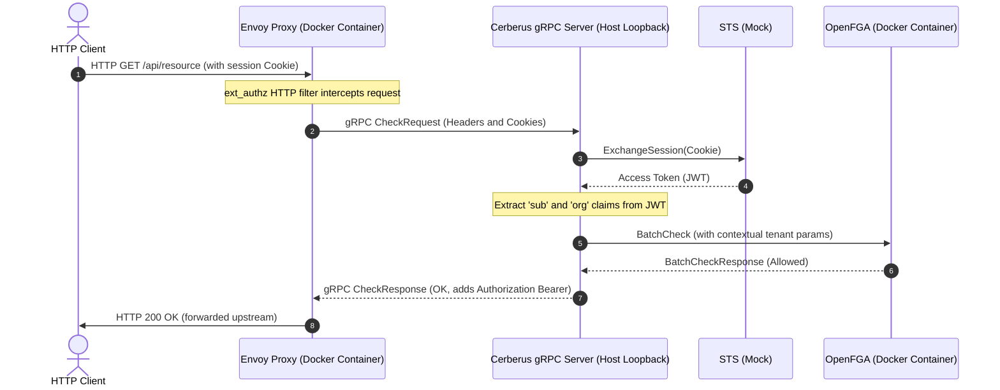

# Envoy External Authorisation Integration Test

This document provides a brief explanation of how the Envoy External Authorisation integration test suite works.

The integration test suite is located in [check_integration_test.go](file:///home/barco/GolandProjects/authorization-service/tests/integration/check/check_integration_test.go).

---

## Architecture Overview

The purpose of this test is to validate the full, end-to-end network contract and protocol translation between **Envoy Proxy**, **Cerberus (ExternalAuthzService)**, and **OpenFGA**.

Rather than spinning up a heavy Kubernetes cluster or a service mesh like Istio, the test sets up a lightweight, containerised environment locally using `testcontainers-go`.

---

## Key Components of the Test

### 1. OpenFGA Container
- A temporary, real OpenFGA docker container is spawned.
- The compiled modular authorization model is uploaded to a temporary test store.
- A relationship tuple (`document:1 reader context` conditioned on `tenant_match`) is persisted in OpenFGA.

### 2. Local gRPC Server
- Cerberus's `ExternalAuthzService` is instantiated on the host machine.
- It is registered onto a standard Go `grpc.Server` listening on a dynamic, free TCP port on `0.0.0.0` (to accept bridge gateway interface connections from Docker).
- Dependencies like STS, OIDC ID Token Verifier, and Resource Mapper are mocked using `gomock` to isolate session exchanges and JWT validation, whilst keeping the OpenFGA integration 100% real.

### 3. Envoy Container
- An official `envoyproxy/envoy:v1.30.0` container is spawned.
- A dynamic, minimised bootstrap configuration is passed into the container using Testcontainers' `Files` field, mapping it to `/etc/envoy/envoy.yaml`.
- The `ext_authz` filter is configured to point back to the local host's gRPC port via `host.testcontainers.internal`.
- **Mock Upstream:** To avoid launching another dummy container to act as the backend application, we route Envoy's routing table to Envoy's own administration server (`127.0.0.1:9901`). When authorisation is successful, Envoy forwards the request internally, resulting in an HTTP `200 OK` response.

---

## Scenarios Tested

The suite verifies three distinct behaviours:

### Scenario A: Multitenancy Enabled - Matching Tenant
- **Setup:** Global tenancy is enabled. The mocked user token contains `"org": "Canonical"`.
- **Action:** An HTTP request with a valid cookie is sent to Envoy.
- **Assertion:** The contextual tuple sent to OpenFGA matches the rule condition. Envoy returns `200 OK` and passes.

### Scenario B: Multitenancy Enabled - Mismatched Tenant
- **Setup:** Global tenancy is enabled. The mocked user token contains `"org": "Ubuntu"`.
- **Action:** An HTTP request with a valid cookie is sent to Envoy.
- **Assertion:** The contextual tuple mismatch causes the OpenFGA relation evaluation to fail. Envoy returns `403 Forbidden` with a custom-rendered body message.

### Scenario C: Multitenancy Disabled - Bypassed Tenant Check
- **Setup:** Global tenancy is disabled. The mocked user token contains `"org": "Ubuntu"`.
- **Action:** An HTTP request is sent to Envoy.
- **Assertion:** Since the multitenancy config flag is inactive, Cerberus bypasses the tenancy constraint evaluation, letting the request succeed even though there is a tenant mismatch. Envoy returns `200 OK`.
